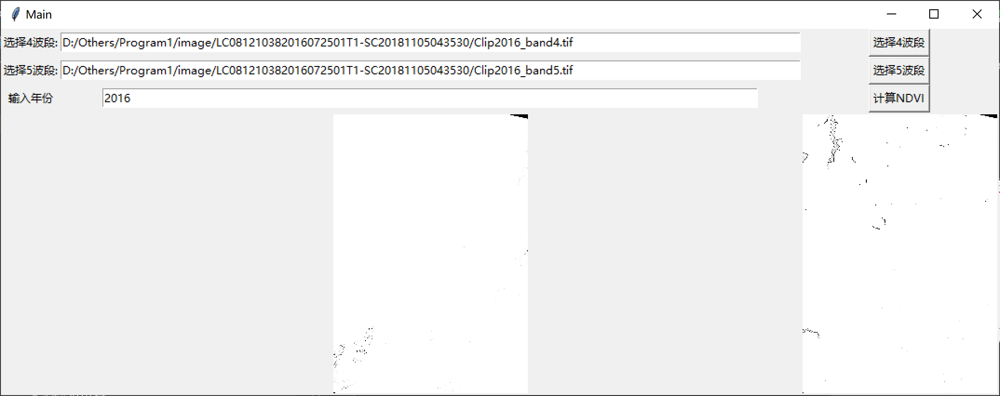
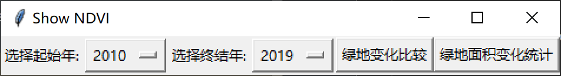
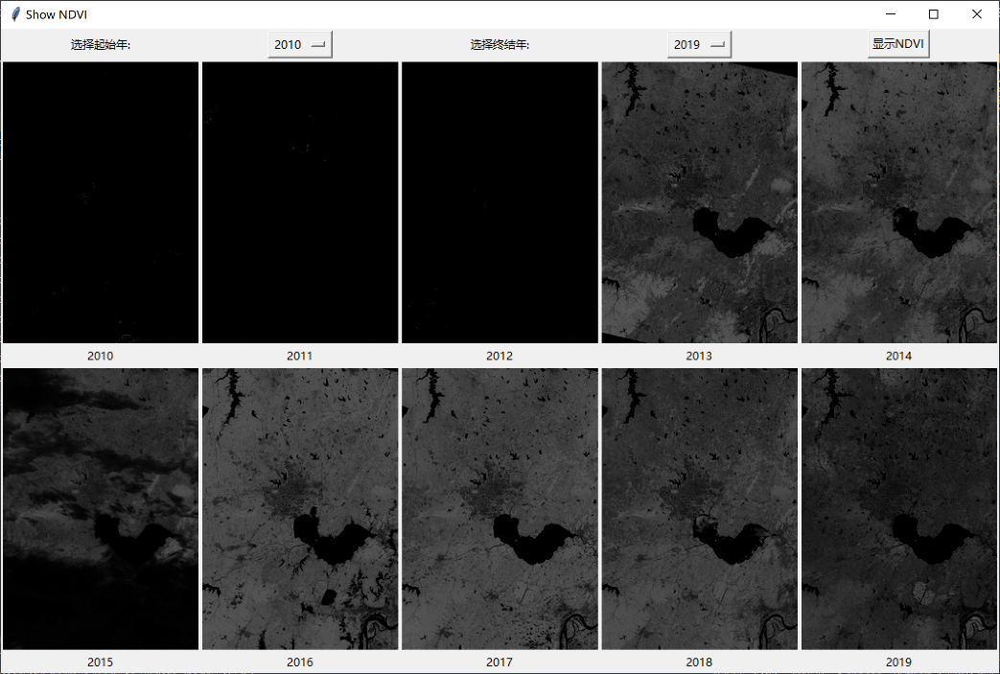

软件详细设计

💡 编写目的
本项目来源于现代化城市生态文明和智慧城市建设的实际需求，利用长时间序列（2010-2019）Landsat遥感影像为原始数据源，采用较先进的植被提取算法（指数），对城市发展过程中城市绿地按年际跟踪变化，完成基于植被指数的合肥地区城市绿地变化检测系统设计与实现，掌握城市绿地空间分布（规模、形状、边界、面积），动态变化和发展趋势，绘制不同年份的城市绿地空间分布图，构建城市绿地变化规律曲线图，系统完成遥感影像的读取，绿地提取和变化检测，按年份输出绿地变化图像，该系统为城市生态文明建设提供必要的技术支撑和规划参考。

🎖️ 总体要求：
        完成所需遥感影像的预处理，选取合适的植被提取算法或指数，完成每年合肥地区城市绿地制图，比较每年绿地变化情况，按年际构建绿地变化曲线，完成按年份统计的绿地变化检测系统设计与实现，系统实现语言不限。所有结论应以实际数据做支撑。
        设计桌面应用程序利用Landsat数据（地面反射率数据）提取合肥市绿地空间分布（规模、形状、边界、面积），不同年份的城市绿地空间分布图，并相互比较，统计不同年份绿地面及的动态变化和发展趋势，构建城市绿地变化规律曲线图。
	
🎌 程序功能及结果描述
1. 遥感影像的读取（路径选取、文件选取）
2. 遥感影像的显示
 3. 绿地提取（NDVI）
 4. 绿地提取结果显示（包括绿地的形状、空间分布、边界显示）
 5. 绿地变化比较（不同年份之间的比较显示）
 6. 绿地面积变化统计
 
🗺️ 算法描述
1. Landsat数据[1]
2013年2月11日，美国航空航天局(NASA) 成功发射Landsat-8卫星。Landsat-8卫星上携带两个传感器，分别是OLI陆地成像仪(Operational Land Imager)和TIRS热红外传感器(Thermal Infrared Sensor)。
　　Landsat-8在空间分辨率和光谱特性等方面与Landsat 1-7保持了基本一致，卫星一共有11个波段，波段1-7，9-11的空间分辨率为30米，波段8为15米分辨率的全色波段，卫星每16天可以实现一次全球覆盖。
传感器	波段	波长范围/μm	信噪比	空间分辨率/m	用途说明
OLI	1-COASTAL/AEROSOL	0.43-0.45	130	30	海岸带环境监测
	2-Blue	0.45-0.51	130	30	可见光三波段
真彩色用于地物识别等
	3-Green	0.53-0.59	100	30	
	4-Red	0.64-0.67	90	30	
	5-NIR	0.85-0.88	90	30	植被信息提取
	6-SWIR1	1.57-1.65q	100	30	植被旱情监测、强火监测、部分矿物信息提取
	7-SWIR2	2.11-2.29	100	30	
	8-PAN	0.50-0.68	80	15	地物识别，数据融合
	9-Cirrus	1.36-1.38	50	30	卷云检测，数据质量评价
TIRS	10-TIR	10.60-11.19	0.4K	100	地表温度反演，火灾检测，土壤湿度评价，夜间成像
	11-TIR	11.50-12.51	0.4K	100	

2.NDVI
       许多研究表明，植被光谱“红边”对植被生长状况反映敏感。其定义为植物反射光谱曲线中斜率最大的点，位于波长690—720 nm之间.
 
Figure1 湿地主要植物反射率曲线[2]
 
Figure2 地物波普数据库曲线[3]
 
根据上图显示，绝大多数植物在近红外和红色波段之间有一个跃迁，能够与其他地物进行区别，因此将卫星可见光和近红外波段进行组合，识别出植被，其中最常用的方法为NDVI植被指数。
NDVI=（NIR-RED）/（NIR+RED）
植被指数是对地表植被状况的简单、有效和经验的度量,目前已经定义了40多种植被指数,广泛地应用在全球与区域土地覆盖、植被分类和环境变化,第一性生产力分析,作物和牧草估产、干旱监测等方面;并已经作为全球气候模式的一部分被集成到交互式生物圈模式和生产效率模式中;且被广泛地用于诸如饥荒早期警告系统等方面的陆地应用。

🗿 结果
1. 遥感影像的读取（路径选取、文件选取）(200)
影像预处理，需要用合肥的边界对影像切割一下，文件在image下的“安徽省合肥市.geojson”里，最好是切割成矩形（因为矩阵长和宽是固定的）

运行mainprogram.py, 出现界面如下图：
 

按规定选取已经截取好的波段4，5图片(在文件夹image下，名字为：Clip年份_波段数.tif, 例：Clip2015_band4)
 
2. 遥感影像的显示(100)
选好后如下图所示, 请记得输入正确的年份(和之后命名与统计绿地面积有关)
 
3. 绿地提取（NDVI）（500）
点击计算NDVI，NDVI公式为NDVI=（NIR-RED）*100/（NIR+RED）
乘以100是因为NDVI算出来为小数，显示时差别不大，因此化成整数，图中较白部分为植物。
4. 绿地提取结果显示（包括绿地的形状、空间分布、边界显示）
5. 绿地变化比较（不同年份之间的比较显示）（700）
运行showNDVI.py,显示：
 
可以选择时间区间，点击绿地变化比较可显示区间年所有的NDVI结果
 
 6. 绿地面积变化统计（300）
点击绿地面积统计：当分辨率为1km时，一个像元代表地面1kmX1km的面积，即1km2；当分辨率为30m时，一个像元代表地面30m×30m的面积
植被面积=像元个数(NDVI>60)* 900/1000000km2
 
🏕️ 环境配置
Python 3.7.4
内存溢出问题：
Pycharm设置：
Help->Find Action->(type "VM Options")->(Click)"Edit Custom VM Options"
打开pycharm64.exe.vmoptions进行编辑
修改-Xmx750m 为 -Xmx4096m     分配4G内存，视情况而定。
保存并重启pycharm
需要C++14.0的一个库
https://blog.csdn.net/qq_38295166/article/details/80704648

[1]https://blog.csdn.net/ddy_sweety/article/details/79729810

[2] http://www.ecologica.cn/stxb/ch/html/2014/20/stxb201301250160.htm

[3] https://www.360kuai.com/pc/94a94cee43a245968?cota=4&kuai_so=1&tj_url=so_rec&sign=360_e39369d1

参考： QGIS Python API documentation project   https://qgis.org/pyqgis/3.4/

